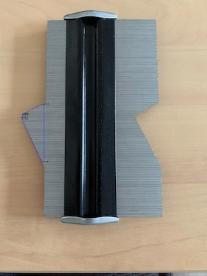
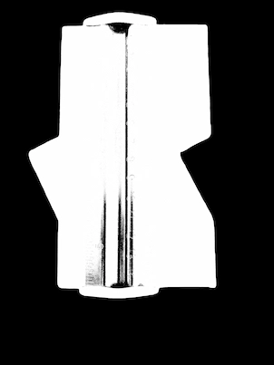
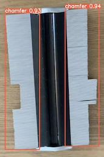
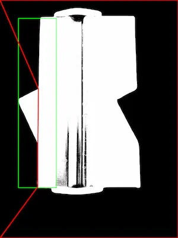
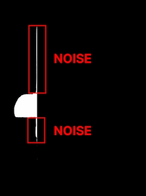

# chamfer-recognition

This project is a **web application** that allows users to **upload** an image of a corner copier. The application then uses a deep learning model to detect and the corner copier in the image. Then **angles** of pieces are calculated.



## Problematic

Many industrial pieces have to respect a specific angle. To verify this, an agent have to use a corner copier. He have to put the piece on the corner copier and check if **angles are respected**.
He reports the result on a paper. This process is long and not very accurate. So we want to automate this process. We want to create a **web application** that allows users to upload an image of a corner copier. Then the application uses a **deep learning model** to detect and the corner copier in the image. Then **angles** of pieces are calculated.

## Background removal

The background removal is done thanks to **Rembg** segmentation model, which is a **U-Net** model trained on the **Adobe Deep Photo** dataset. The model is available on the [Rembg GitHub repository](https://github.com/danielgatis/rembg) 



## Get side coordinates

The `get_chamfer_coords` function takes an `image`, a `model`, and a `threshold` value as input. It uses the provided model to detect **objects** in the image and filters the detected objects to only keep those with a class label of 0 and a confidence value above the specified threshold. It then returns the `coordinates` and `confidence` values of the detected objects. If no objects are detected or the number of detected objects is not equal to 2, it raises an HTTP exception with an error message. If exactly **2 objects are detected**, it also calculates the **angle** between the two objects and a reference point (the right edge of the image) and raises an HTTP exception if the angle is greater than 5 degrees. Finally, it returns the `coordinates` and `confidence` values of the detected objects.

```py
def get_chamfer_coords(image, model, threshold=0.5):
  if side detected in image:
    return save coordinates of the side
  else:
    raise an error
  verify if angle between the two sides is less than 5 degrees
```



## Cleaning piece

The `cleaning_mask2piece` function takes a binary image (mask) and a list of coordinates as input. It uses the OpenCV library to find the contours in the mask and **filter** the contours to keep only the largest one. It then uses the `cv2.approxPolyDP` function to approximate the shape of the contour, calculates the **convex hull** of the contour, and computes the bounding rectangle of the hull.

Next, it calculates the center of the provided **coordinates** and uses it to find the two sides of the bounding rectangle that are closest to the center. It also calculates the **coordinates** of the corners of the bounding rectangle.

Finally, it uses the `coordinates` of the bounding rectangle, the center, and the **closest sides** to determine which part of the **mask corresponds** to the **piece** of paper and removes the rest of the mask. It then returns the resulting mask.



For example the result of the `cleaning_mask2piece` function is the following. But, as you can see, the mask contains some pixel **noised** from the "piece cutting" process. We can remove them by using the following code. It will remove all the pixel lines that have less than 30 pixels. It is not a part of piece.



```py
def cleaning_piece(piece):
    contours = get contours of the piece
    filter contours to keep only the largest one
    remove the rest of the mask

    # if the piece mask contain pixel noise from the "piece cutting" process
    # we can remove them by using the following code
    # it will remove all the pixel lines that have less than 30 pixels
    # it is not a part of piece

    for pixel line : 
        if pixel line has less than 30 pixels:
            remove the pixel line
```


## Get pieces corners

The `get_piece_corners` function takes a binary image (mask) as input. It uses the **OpenCV** library to find the `contours` in the mask and filter the contours to keep only the largest one. It then calculates the **convex hull** of the contour and draws the **hull** on the mask. Finally, it returns the `coordinates` of the corners of the hull as a numpy array.

```py
def get_piece_corners(piece):
    contours = get contours of the piece
    filter contours to keep only the largest one
    calculate the convex hull of the contour
    return the hull contours as corners
```

## Calculating angles degrees

The `get_angles` function takes a list of coordinates as input and uses the get_angle_complex function to calculate the angle between each pair of consecutive points and their following point in the list. It returns a list of angles in degrees. For example, if the input list is `[[0, 0], [1, 0], [1, 1], [0, 1]]`, the function will calculate the angles between `[0, 0]` and `[1, 0]`, `[1, 0]` and `[1, 1]`, and `[1, 1]` and `[0, 1]`, and return a list with the calculated angles.

```py
def get_angle_degrees(corners):
    angles = []
    for i in range(len(corners)-2):
        angle = get_angle_complex(corners[i], corners[i+1], corners[(i+2)])
        angles.append(angle)
    return angles
```

## Get image drawn

The `get_image_drawn` function takes an `image`, a list of `coordinates`, a list of `angles` in degrees, and a `maximum angle` threshold as input. It uses the **OpenCV** library to draw a polyline on the image that connects the coordinates in the list in order. It also creates a white image with the same dimensions as the input image.

For each `angle` in the list of `angles`, it checks if the angle is smaller than the maximum angle threshold. If it is, it draws a circle on the image at the corresponding coordinate in the list of `coordinates`, and writes the angle next to the circle.

Finally, the function returns the **original image** with the **polyline** and **circles** drawn on it, and the white image.

